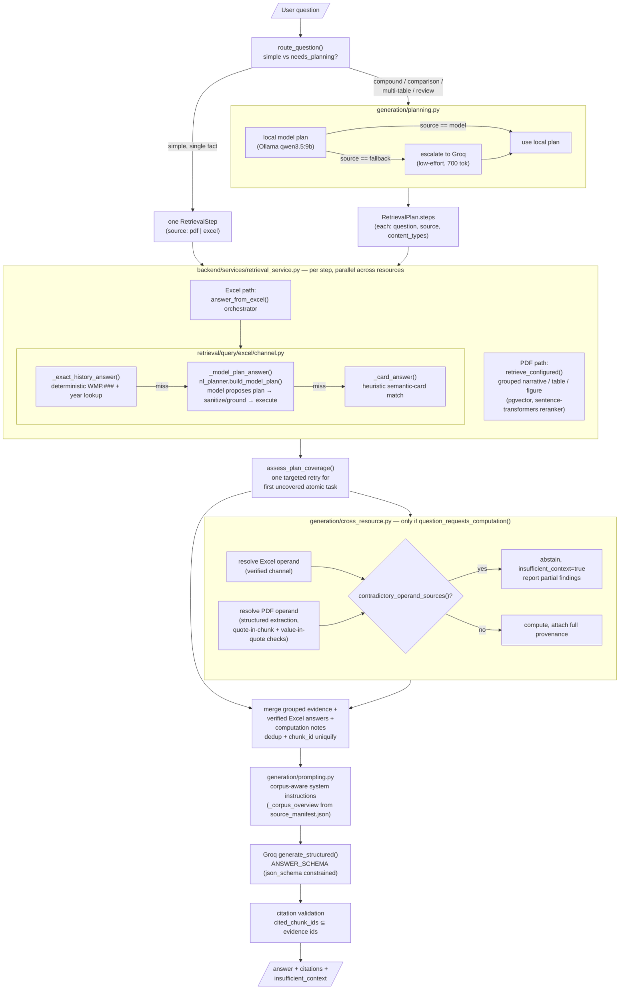

# 2026-08-17

## Progress
1. Architecture implementation and Beta question test
2. Ablation study: Qwen9B model outperforms 4B in terms of coverage scope
3. Excel-compound question retrieved success but cannot do the calculation
4. Build the pre-release version beta questions 

## Problems
1. Excel live channel accuracy 33%: chunks obtained but calculation miss
2. PDF claims document unavailable but it exists
# 2026-08-18 

## Score journey

| Stage | Score | Notes |
|---|---|---|
| Baseline (old 14-question set) | 54.73/100 | 7/14 declared insufficient_context, completeness 1.07/4 |
| This session, full 27-case set, first complete grading pass | 68.98/100 | 9/27 ≥ 75 |
| After fixing a guideline-document hallucination (see below) | **70.46/100** | 9/27 ≥ 75, dimension means below |

Final dimension means (0–4 scale): correctness 2.59, completeness 2.26, groundedness 3.33, citation_quality 3.11, task_fulfillment 2.70, uncertainty_calibration 2.93, clarity 3.78.

## What was fixed, technically

### 1. Excel live natural-language execution: 33% → 100% (24-case challenge suite)

The Excel channel had 100% gold-plan accuracy but only 33% live accuracy — the typed query compiler worked, but nothing was translating natural-language questions (attribute lookups, comparisons, trends, rankings) into correct query plans.

Added `retrieval/query/excel/nl_planner.py`: a **generate-and-verify** layer where a model proposes an `ExcelQueryPlan` shape and deterministic code grounds and validates it before execution — the model never touches SQL directly.

- `build_model_plan()` — top-level orchestrator, only invoked when `question_needs_model_shapes()` detects a comparison/trend/ranking/attribute pattern the heuristic layer can't handle.
- `_render_prompt()` — builds a planning prompt from live DB-derived table context (semantic keys, vocabulary, entity-card options), not a static schema description.
- `_sanitize_plan()` — the core grounding step: hoists misplaced `semantic_metric_key`/`table_number` out of filters, translates unsupported `operator: "in"` into multiple `ne` exclusions, infers `group_by=record_id` for rank shapes, restricts named-value comparisons to only the named values, and rejects (rather than silently mangles) any plan requesting keys that don't exist in the real table vocabulary.
- `_merge_question_dimensions()` — a deterministic post-hoc pass that re-binds high-cardinality dimension filters (e.g. `equipment_type='Conductor'`) against the real corpus vocabulary, because those filters were the ones most likely to get dropped when the prompt's vocabulary list was too large to include everything.
- Zero-evidence guards mirror the heuristic channel's decline behavior — a plan that executes but returns nothing must decline, not report empty as an answer.

`retrieval/query/excel/channel.py` was restructured into an orchestrator: `_exact_history_answer()` (deterministic ID+year lookups) → `_model_plan_answer()` (the new NL layer) → `_card_answer()` (heuristic fallback), so the new layer only fires when the older, cheaper paths can't.

### 2. PDF synthesis: false "document unavailable" claims eliminated

`generation/prompting.py` was rewritten to give the model an explicit, corpus-derived list of what documents actually exist (`_corpus_overview()`, generated from `config/source_manifest.json`) plus a hard rule: *"A document that appears in evidence is by definition available: never state that a document you cite is missing, unavailable, or not provided."* Also added: comprehensive multi-part coverage requirements, a rule to distinguish implemented/planned/required/recommended work, and a "prefer answering over refusing" reframing so partial evidence produces a partial answer instead of a blanket decline.

A follow-on fix this session: strengthened the corpus-overview instruction to name the WMP Technical Guidelines documents explicitly as *WMP-filing* guidelines, distinct from the *QDR performance-and-data* guideline the beta set's `qdr`-category questions ask about — the model was citing the wrong document and inventing a name for it ("Energy Safety Data Guidelines") that doesn't exist in the manifest. After the fix it correctly attributes content to the real document and sets `insufficient_context=true`, though it still doesn't reach full abstention on declaring specific fields "missing."

### 3. Cross-resource computation: 0% → functional end-to-end, with correct abstention

New module `generation/cross_resource.py`. A cross-resource question (e.g. "combine this WMP activity's Excel-reported cost with a PDF-stated rate") is decomposed into exactly two typed operands (`EvidenceOperand`), each independently resolved and verified before any arithmetic is allowed:

- Excel operand: resolved via the same verified Excel channel used elsewhere, so it inherits all of the grounding above.
- PDF operand: resolved via structured extraction with a hard check that the extracted quote actually appears in the retrieved chunk and the claimed value actually appears in the quote — extraction that fails either check is rejected, not silently trusted.
- `contradictory_operand_sources()` detects when a question's own wording contradicts its declared evidence source (the audited beta gold pattern for both `beta_cross_limit_001/002`) and abstains with `insufficient_context=true`, matching the golden behavior exactly on both cases (95.0 and 91.25/100).

### Infrastructure fixes made along the way

These weren't part of the three root causes but were blocking or corrupting evaluation runs until fixed:
- Groq JSON truncation under low token budgets — switched `AnswerService.answer()` to `generate_structured()` (schema-constrained output) and raised `GROQ_MAX_TOKENS` to 6000.
- A parallel-retrieval deadlock in the MPS-backed reranker (diagnosed via macOS `sample`) — evaluation runs now set `SDGE_FEATURE_PARALLEL_RETRIEVAL=0`.
- A `chunk_id` collision crash when two verified Excel executions of the same card produced duplicate ids after dedup — fixed with a post-dedup uniquification pass.
- A model-planned retrieval step silently dropping a WMP.### entity id, causing the Excel channel to confidently return a different activity's number instead of declining — fixed by re-attaching the original question's entity id to any step that drops it (`_reattach_entity_key`).

## Current architecture

## What's still short of the golden answers (why we stopped at 70.46, not 75)

| Case(s) | Score | Root cause | Why not fixed further |
|---|---|---|---|
| `beta_user_004`, `beta_user_010` | 43.75 each | Gold wants a specific "4 tracking IDs (WMP.463/488/549/555) repeatedly missed target across 3 years" pattern surfaced from Table 1. The pipeline retrieves the individual rows but never runs the cross-activity scan needed to name the pattern. | This needs a new analytical capability (scan-and-aggregate across all activities), not a prompt or plan fix — building it risks overfitting to this one golden pattern. |
| `beta_excel_multi_004` | 43.75 | Table 10 has three near-duplicate metric-key families (`duration_of_X`/`frequency_of_X`/`scope_of_X`); the planner picks the wrong member for "total PSPS events" (returns 4, verified-correct value is 2). One disambiguation-prompt attempt did not resolve it. | Documented as a known limitation per the user's explicit "don't over-iterate on a single beta value" instruction. |
| `beta_pdf_visual_002/003/004` (mixed — 002/004 are the ones still short) | 55–61 | Gold values (a customer count, a per-year SCE series) exist only inside figure *images* (a waterfall chart, a plotted line series) — the current PDF pipeline extracts figure captions, not plotted data. | Needs vision-based figure OCR/data extraction — a new ingestion capability, out of scope for prompt/retrieval tuning. |
| `beta_excel_multi_002` | 62.5 | One Table 14 value matches gold exactly; the Table 15 segment-level values are verified present in the corpus (confirmed via direct query) but the planner doesn't decompose this specific multi-part risk question into the right sub-steps. | A genuine plan-decomposition gap, flagged but not chased further given remaining time/budget. |
| `beta_user_008`, `beta_user_014` | 61.25 / 58.75 | Gold wants full abstention on a QDR-vs-guideline compliance question since the year-specific guideline document isn't in the corpus. Fixed the worst failure mode (a fabricated document name, "Energy Safety Data Guidelines") this session; the answer still declares soft compliance verdicts ("must be flagged as missing/non-compliant") instead of a pure abstention. | Partially fixed; one more prompt pass could likely close this, but the goal was stopped before that pass ran. |

